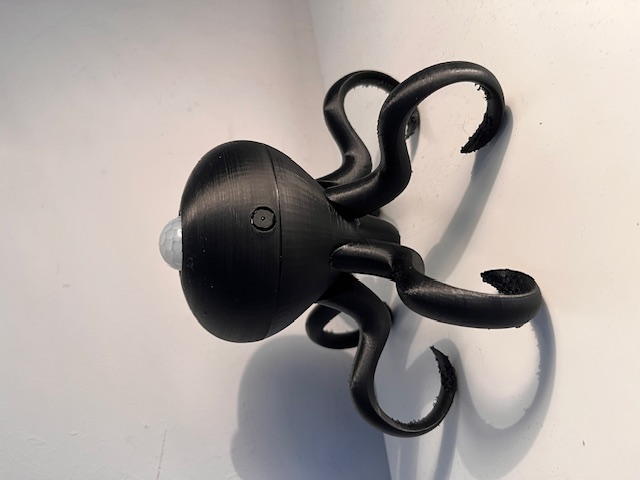

Project Description

HARDWARE:

esp32-cam
FIR sensor
Battery
RGB leds
switch
case

GOAL FUNCTIONALITY:

Connect to local wifi through web-page to insert login password and email adress to be sent.

off mode (HW implemented) -> using the switch to ON/OFF the device.

Battery powered

3D printed case - artistic and adaptable

standby mode (Main function) -> reading FIR sensor and, case activated, take 3 pictures and send to email.

    filming mode -> this will require lots of energy to record, connect to wifi, upload and send email. Must happen rarely.

    scanning mode -> PIR is a passive sensor so this must be in low energy mode.

online mode (future idea) -> be able to take pictures from webpage.

RGB led colours will indicate operation mode

CURRENT FUNCTIONALITY:

It's sending picture into a certain ip address (raspiberry pi). The raspberry Pi is connected to the same wifi network running a PHP server and storing the pictures. The idea is that esp32 can come back to sleep.

TUTORIALS FOLLOWED:

https://randomnerdtutorials.com/esp32-cam-post-image-photo-server/

https://randomnerdtutorials.com/raspberry-pi-apache-mysql-php-lamp-server/
